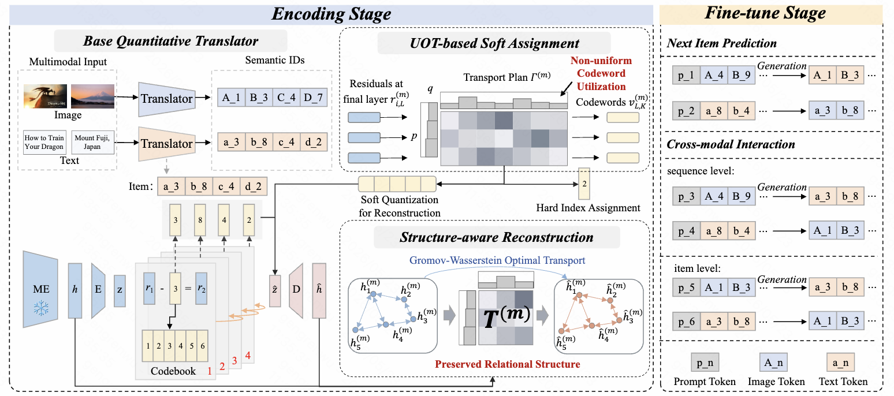

# ReSOT

**ReSOT: Re-balance Semantic ID with Optimal Transport for Generative Recommendation** (KDD'26)



## Setup

```bash
pip install torch transformers accelerate peft scikit-learn
```

## Project Structure

```
ReSOT/
├── data_process/          # Data preprocessing scripts
│   ├── amazon18_data_process.py   # Process raw Amazon data
│   ├── amazon_text_emb.py         # Generate text embeddings (LLaMA)
│   └── clip_feature.py            # Generate image embeddings (CLIP)
│
├── data/                  # Datasets
│   └── {Dataset}/
│       ├── {Dataset}.inter.json          # User-item interaction sequences
│       ├── {Dataset}.item.json           # Item metadata
│       ├── {Dataset}.item2id             # Item ID mapping
│       ├── {Dataset}.emb-llama-td.npy    # Text embeddings (4096-dim)
│       ├── {Dataset}.emb-ViT-L-14.npy   # Image embeddings (768-dim)
│       ├── {Dataset}.index_lemb.json     # Text semantic IDs (generated by Step 2)
│       └── {Dataset}.index_vitemb.json   # Image semantic IDs (generated by Step 2)
│
├── index/                 # RQ-VAE training and semantic ID generation
│   ├── main_mul.py                       # Training entry point
│   ├── trainer.py                        # Training loop
│   ├── datasets.py                       # Dataset classes
│   ├── generate_indices_distance_mul.py  # Multi-dataset SID generation
│   ├── generate_indices_distance.py      # Single-dataset SID generation
│   ├── models/
│   │   ├── rqvae.py   # RQVAE with Fused GW-OT and diversity loss
│   │   ├── rq.py      # Residual vector quantizer
│   │   ├── vq.py      # VQ with UOT soft assignment at final layer
│   │   └── layers.py  # MLP, sinkhorn, UOT mirror-gradient, BADMM-GWOT
│   └── scripts/
│       ├── run.sh             # Train RQ-VAE
│       └── gen_code_dis.sh    # Generate SID index files
│
├── ablation/              # Ablation experiments (6 variants)
│   ├── ablation_rqvae.py          # AblationRQVAE (use_gwot / use_uot / use_sq switches)
│   ├── train_ablation.py          # Ablation training entry
│   ├── generate_ablation_index.py # Ablation SID generation
│   └── scripts/                   # run_ablation_v{1-6}.sh
│
├── baseline/              # Baseline methods
│   ├── gr_index/          # GR tokenizer baselines (TIGER, LC-Rec, LETTER, MME-SID, MQL4GRec, MACRec)
│   ├── sr_baselines/      # Sequential recommendation baselines (SASRec, BERT4Rec, FDSA, S3-Rec, VQ-Rec, MISSRec)
│   └── text_gr/           # Text ID baselines (P5-CID, VIP5)
│
├── config/ckpt/           # T5 model config and tokenizer
├── pretrain.py            # T5 multi-dataset pretraining
├── finetune.py            # T5 single-dataset fine-tuning
├── test.py                # Single-GPU evaluation
├── test_ddp.py            # Multi-GPU DDP evaluation
├── test_ddp_save.py       # Multi-GPU evaluation with output saving
├── ensemble.py            # Text + image ensemble
├── data.py                # Dataset classes for fine-tuning
├── collator.py            # Data collators
├── evaluate.py            # Metrics: Hit@k, NDCG@k
├── generation_trie.py     # Trie-constrained decoding
├── utils.py               # Argument parsing and utilities
├── scripts/
│   ├── pretrain.sh        # Multi-dataset T5 pretraining script
│   ├── launch_rqvae.sh    # Launch RQ-VAE training (Instruments)
│   ├── launch_rqvae_games.sh
│   └── launch_rqvae_all.sh
└── run_pipeline.sh        # End-to-end pipeline script
```

## How to Run

### Step 1: Data Processing

Download raw data from [Amazon Review Data 2018](https://cseweb.ucsd.edu/~jmcauley/datasets/amazon_v2/). Preprocessed data (embeddings + interactions) and pretrained RQ-VAE models are also available on Google Drive: [Data & Models](https://drive.google.com/file/d/1cSFpVZLRYH6HZAmkGbi9TfMnXRgkuIhW/view?usp=drive_link)

```bash
# Process raw Amazon 2018 data
python data_process/amazon18_data_process.py --dataset Instruments --data_root ./data

# Generate text embeddings (requires LLaMA)
python data_process/amazon_text_emb.py --dataset Instruments --data_root ./data

# Generate image embeddings (requires CLIP ViT-L/14)
python data_process/clip_feature.py --dataset Instruments --data_root ./data
```

### Step 2: Train RQ-VAE and Generate Semantic IDs

```bash
cd index

# Train RQ-VAE (text + image)
bash scripts/launch_rqvae_all.sh

# Generate semantic ID index files
bash scripts/gen_code_dis.sh
```

Key arguments for `main_mul.py`:

| Argument | Default | Description |
|----------|---------|-------------|
| `--num_emb_list` | `256 256 256 256` | Codebook sizes per layer |
| `--e_dim` | `64` | Codebook embedding dimension |
| `--use_ot_loss` | `1` | Enable Fused GW-OT structural loss |
| `--use_uot` | `1` | Enable UOT soft assignment at final layer |
| `--uot_tau_row` | `1.0` | UOT KL weight for item marginal (τ₁) |
| `--uot_tau_col` | `0.1` | UOT KL weight for code marginal (τ₂) |
| `--uot_eta` | `0.01` | Mirror-gradient step size (η) |
| `--uot_iters` | `30` | Mirror-gradient iterations |
| `--badmm_iters` | `5` | BADMM iterations for GW-OT |
| `--fgw_alpha` | `0.25` | Fused GW-OT feature cost weight |

### Step 3: Pretrain T5

```bash
bash scripts/pretrain.sh
```

### Step 4: Fine-tune and Evaluate

```bash
# Fine-tune on a single dataset
python finetune.py --dataset Instruments --data_root ./data \
    --pretrain_ckpt <pretrain_output_dir> \
    --output_dir ./log/Instruments

# Evaluate (single GPU)
python test.py --dataset Instruments --data_root ./data \
    --ckpt_path <finetune_output_dir> --num_beams 20

# Evaluate (multi-GPU DDP)
torchrun --nproc_per_node=4 test_ddp.py --dataset Instruments \
    --data_root ./data --ckpt_path <finetune_output_dir> --num_beams 20

# Ensemble (text + image)
python ensemble.py --dataset Instruments
```

### One-Command Pipeline

```bash
bash run_pipeline.sh
```

## Ablation Variants

| Variant | GWOT | UOT | SQ | Notes |
|---------|------|-----|-----|-------|
| v1 | ✗ | ✗ | ✗ | Equivalent to TIGER |
| v2 | ✗ | ✓ | ✓ | UOT soft assignment only |
| v3 | ✓ | ✗ | ✗ | GW-OT structural recon only |
| v4 | ✓ | ✗ | ✓ | GW-OT + balanced Sinkhorn |
| v5 | ✓ | ✓ | ✗ | GW-OT + UOT without soft quantization |
| v6 | ✓ | ✓ | ✓ | Full ReSOT |

```bash
cd ablation
bash scripts/run_ablation_v6.sh
```
